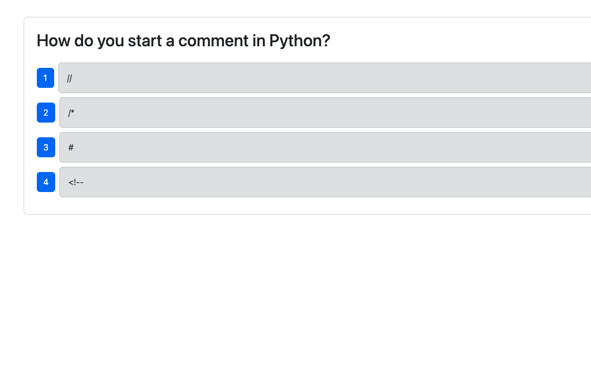
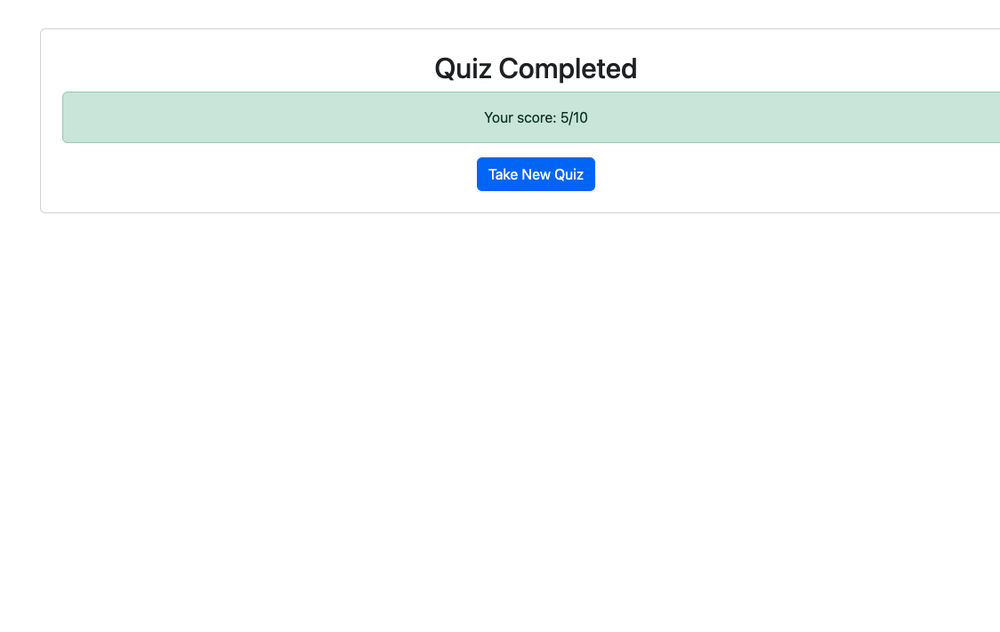
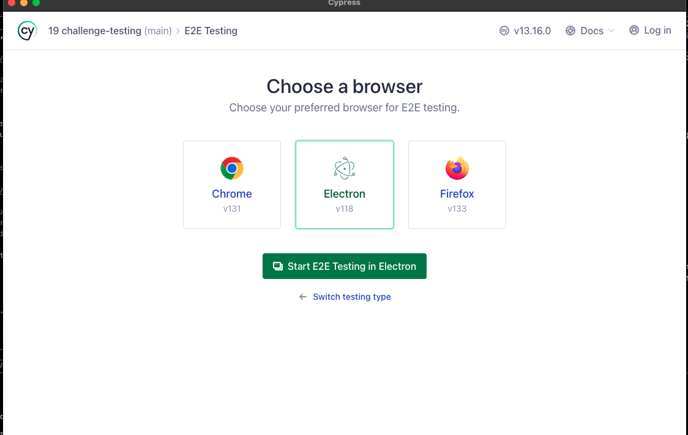
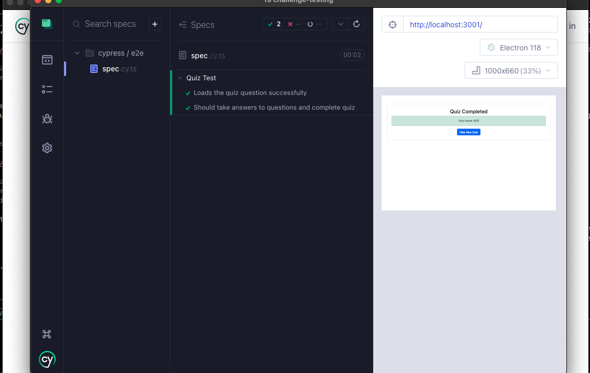

# Testing-19
# Candidated Search 

<div align="center">

</div>

<div align="center">
 
  <h3 align="center">MC Foster Portfolio</h3>

  <p align="center">
about app

  <br />
    <a href=""><strong>Explore the docs »</strong></a>
  </p>
</div>

      
 
<details>
  <summary>Table of Contents</summary>
  <ol>
    <li>
      <a href="#about-the-project">About The Project</a>
      <ul>
        <li><a href="#built-with">Built With</a></li>
      </ul>
    </li>
    <li>
      <a href="#getting-started">Getting Started</a>
      <ul>
        <li><a href="#installation">Installation</a></li>
      </ul>
    </li>
    <li><a href="#usage">Usage</a></li>
    <li><a href="#roadmap">Roadmap</a></li>
    <li><a href="#contributing">Contributing</a></li>
    <li><a href="#license">License</a></li>
    <li><a href="#contact">Contact</a></li>
    <li><a href="#acknowledgments">Acknowledgments</a></li>
  </ol>
</details>


## About The Project

This dynamic and interactive Tech Quiz Application, built using the MERN stack with a React front end, MongoDB database, and Node.js/Express.js server and API, helps aspiring developers test their knowledge and improve their skills. Users can start the quiz with a simple button click, answer ten random questions one at a time, and view their final score upon completion. After reviewing their performance, they can restart the quiz to continue learning and challenging themselves in a fun and engaging way.

[Walk Thru Video](https://youtu.be/lDHHuDRRYo0)
 











### Built With

<div align="center">


[](https://javascript.info/)
[](https://typecript.info/)
[](https://code.visualstudio.com/docs)
[](https://react.info/)
[](https://vite.info/)
[](https://cypress.io)

</div>


## Getting Started

Once completely built, this application will function as a deployed app on Netlify.

### Local Installation / Testing

1. Clone the rep

```
git clone 
```

2. Install dependencies

```
npm i, npm cypress, react-router
```

3. Launch the app in the terminal

```
npm run start:dev
```

4. Then, Launch the app in a seperate terminal

```
npx cypress open
```


#### MVP


- [ ] Back End
  - [ ] Landing page of Quiz


 - [ ] Testing on Cypress


## Contributing

Contributions are what make the open source community such an amazing place to learn, inspire, and create. Any contributions you make are **greatly appreciated**.

If you have a suggestion that would make this better, please fork the repo and create a pull request. You can also simply open an issue with the tag "enhancement".
Don't forget to give the project a star! Thanks again!

1. Fork the Project
2. Create your Feature Branch (git checkout -b feature/AmazingFeature)
3. Commit your Changes (git commit -m 'Add some AmazingFeature')
4. Push to the Branch (git push origin feature/AmazingFeature)
5. Open a Pull Request


## License

This project is licensed under the MIT license.

[](https://opensource.org/licenses/MIT)

## Contact


[Marie-Chantal Foster](mariechantalfoster@gmail.com) 

Project Links:

[Github Repository](https://github.com/MCFoster007/Testing-19)

[Github Pages Deployment]( https://mcfoster007.github.io/Testing-19/)


## Acknowledgments
Thank you to my tutors, Mary and Andres and instructor Dan, who helped me and guided me.


